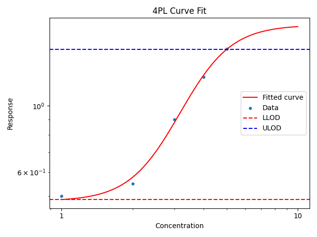
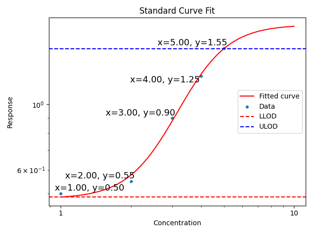

# bio-curve-fit

A Python package for fitting common dose-response and standard curve models. Designed to follow the [scikit-learn](https://scikit-learn.org/stable/) api.

## Quickstart 

### Installation

```shell
pip install bio-curve-fit
```


We recommend using python [virtual environments](https://docs.python.org/3/library/venv.html) to manage your python packages in an isolated environment. Example:

```shell
python -m venv venvname
source venvname/bin/activate
```

### Example usage:

```python
from bio_curve_fit.logistic import FourParamLogistic

# Instantiate model
model = FourParamLogistic()

# create some example data
standard_concentrations = [1, 2, 3, 4, 5]
standard_responses = [0.5, 0.55, 0.9, 1.25, 1.55]


# fit the model
model.fit(
	standard_concentrations, 
	standard_responses, 
)

# interpolate the response for new concentrations
model.predict([1.5, 2.5])

# interpolate the concentration for new responses
model.predict_inverse([0.1, 1.0])

```

Calculate and plot the curve and limits of detection:

```python
plot_standard_curve(standard_concentrations, standard_responses, model, show_plot=True)
```



You can also customize the plot arbitrarily using matplotlib. For example, adding labels to the points:

```python
from adjustText import adjust_text

fig, ax = plot_standard_curve_figure(standard_concentrations, standard_responses, model)
texts = []
for x, y in zip(standard_concentrations, standard_responses):
	texts.append(ax.text(x, y, f"x={x:.2f}, y={y:.2f})", fontsize=13, ha="right"))
# Adjust text labels to avoid overlap
adjust_text(texts, ax=ax)
```




## Examples

See the [example notebooks](./examples/) for more detailed usage.

## Contributing

Contributions are welcome! We built this package to be useful for our own work, but we know there is more to add.
Please see [CONTRIBUTING.md](CONTRIBUTING.md) for more information.
